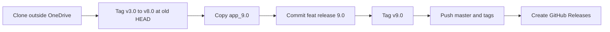

# Plan: Versioned history + GitHub Releases (1B + 2A)

## Goal

Publish local version folders `app 3.0` → `app_9.0` to **https://github.com/lawrencekuo1118/theYNowApp** with annotated tags and GitHub Releases describing each version.

## Confirmed decisions

| Item | Choice |
|------|--------|
| Scope | 1B — full sequence through v9.0 |
| Notes format | 2A — GitHub Releases + tags (`v3.0` … `v9.0`) |
| Push target | `https://github.com/lawrencekuo1118/theYNowApp` (origin already points here) |
| Release notes | Drafted by comparing consecutive version folders (user can edit before publish) |
| Repo layout | Keep existing **side-by-side** version folders (do not rewrite into a single `app/` history) |

## Current remote state (verified via API)

- Default branch: `master`
- Latest commit: `87e536f` — `chore: clean up and optimize gitignore`
- Already on GitHub: `app 3.0` … `app 7.0`, `app_8.0` (and misc root/demo files)
- **Missing on GitHub:** `app_9.0` (HTTP 404)
- **Tags:** none · **Releases:** none
- Local `origin` already matches this repo URL

## Approach (concrete)

1. **Work outside OneDrive**  
   Local git under OneDrive hangs / locks. Fresh clone to a local path (e.g. `~/Developer/theYNowApp-publish`), then copy only the needed version folders from the OneDrive tree into that clone.

2. **Install `gh` if missing**  
   `brew install gh` then `gh auth status` (login if needed). Releases will be created with `gh release create`.

3. **Code commit (only new snapshot)**  
   - Copy local [`app_9.0`](app_9.0) into the clone root (same naming as local).  
   - Respect existing [`.gitignore`](../.gitignore) (no `.RData`, venv, `.DS_Store`, etc.).  
   - One commit on `master`: `feat: release version 9.0`  
   - Do **not** force-push or rewrite history for v3–v8 (folders already on remote).

4. **Tags**  
   - On the commit **before** adding `app_9.0` (current remote HEAD `87e536f`): annotated tags `v3.0` … `v8.0` (document versions already present as folders).  
   - On the new v9.0 commit: annotated tag `v9.0`.

5. **Push**  
   - `git push origin master`  
   - `git push origin v3.0 v4.0 v5.0 v6.0 v7.0 v8.0 v9.0`  
   Target remotes only: **lawrencekuo1118/theYNowApp**.

6. **GitHub Releases**  
   For each tag, `gh release create` with title `theYNowApp vX.0` and body from the draft notes below (Chinese, concise). Mark `v9.0` as latest.

## Draft release notes (from folder inventory)

### v3.0 — Baseline modular Shiny app
- Modular files: `FFD_shinyapp 3.0.R`, `global.R`, `setup.R`, `kpi_module.R`, `fcf_projection_module.R`, `industry_standards.R`, `search_module.R`, `app_alpha_beta.R`

### v4.0 — Module renames / iteration
- Updated shiny entry to `FFD_shinyapp 4.0.R`
- Search/setup/alpha-beta iterated as `search_module2.R`, `setup2.R`, `app_alpha_beta2.R`

### v5.0 — Versioned helper modules
- Entry `FFD_shinyapp 5.0.R`
- Helpers renamed: `global 2.0.R`, `search_module 4.0.R`, `setup 5.0.R`
- Dropped separate alpha-beta module from this snapshot

### v6.0 — ui/server split + report template
- Architecture moves to `ui.R` + `server.R`
- Adds `report_template.Rmd`
- Removes monolithic `FFD_shinyapp 5.0.R`

### v7.0 — DDM + scraping config
- Adds `ddm_module.R`, `deep_scraper.py`, `default_config.R`
- Continues ui/server + report template

### v8.0 — Residual income + crawler
- Adds `ri_module.R`, `web_crawler5.R`
- Setup renamed to `setup7.R`
- Drops duplicate `global 2.0.R` / old search module naming from this snapshot

### v9.0 — Investment decision + PB asset modules
- Adds `investment_decision_module.R`, `pb_asset_module.R`
- Normalizes names: `setup.R`, `web_crawler.R`
- Retains DDM, RI, ui/server, report template, deep scraper, default config

## Execution gate

**Do not run commits, push, tags, or releases until you explicitly approve this plan** (e.g. “execute the plan” / “開始執行”).

## Out of scope

- Rewriting git history so each commit only contains one version folder
- Force-push to `master`
- Uploading OneDrive junk (venv, `.RData`, PDFs already unrelated)

## Success criteria

- https://github.com/lawrencekuo1118/theYNowApp contains `app_9.0`
- Releases page shows `v3.0` … `v9.0` with the notes above
- `master` tip is the v9.0 commit; `v9.0` is the latest release
